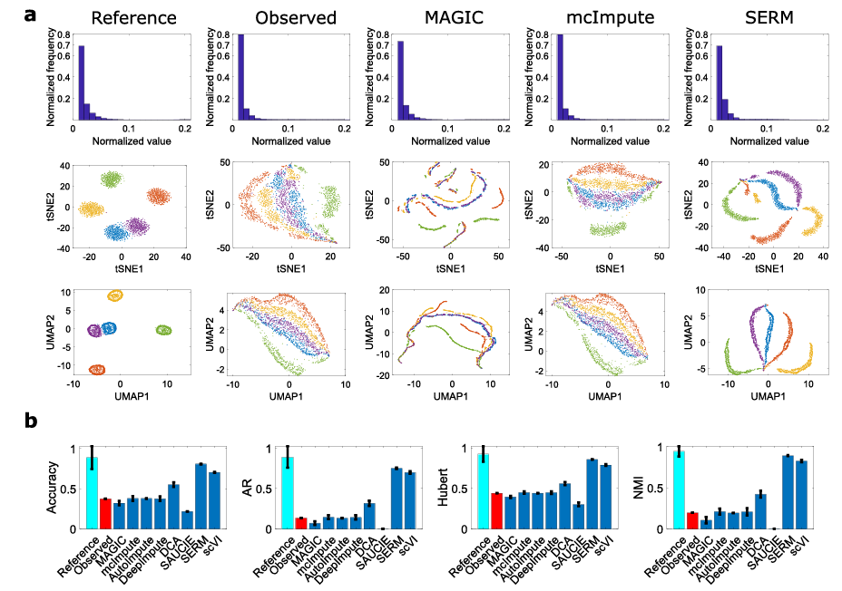

# self-consistent-expression-recovery-machine (SERM)
SERM is a data-driven gene expression recovery framework. Using deep learning, SERM first learns from a subset of the noisy gene expression data to estimate the underlying data distribution. SERM then recovers the overall gene expression data by analytically imposing a self- consistency on the gene expression matrix, thus ensuring that the expression levels are similarly distributed in different parts of the matrix.

# How to use SERM?
The gene expression data should be in matrix format (rows are cells and collumns are genes). There are a few parameters: 1) ROI length and width: SERM divides the whole matrix into a number of ROIs. The user can choose the size of the ROI that would be used by SERM. Good values for ROI height can be: cell number divided by 4 or 8 and ROI width can be gene number divided by 4 or 8. 2) Percent overlap: This parameter dictates how much overlap will be between two consecutive ROIs. The user can choose any value between 0.01 to 0.99. However, for small overlap, the consecutive windows would be disconnected and for large window size, more computation will be necessary. A value between 0.25 or 0.75 works well with SERM. 

We are developing the Python and R codes for SERM. Please check back this repository for Python and R implementations. 

# About parameter settings:
SERM works well for a large range of parameters. Thus, even without careful settings, it provides much better results than traditional techniques.

# Example:
Please see the demos or our web-based tool (https://www.analyxus.com/) for an easy start. In our web-based tool, choose "Gene expression recovery" as the data type and SERM as the data anlaysis method. Enjoy! 

# Results:

Figure. (a1)-(d5) Single cell RNA-seq data with 20 classes simulated with Splatter simulator. Classes 1-20 have
the same rate parameter of 0.9 and shape parameters of 0.10, 0.11, 0.15, 0.16, 0.20, 0.21, 0.25, 0.26, 0.30, 0.31, 0.35, 0.36,
0.40, 0.41, 0.50, 0.52, 0.70, 0.71, 0.80 and 0.805, respectively. Dropout shape is set to -1, dropout midpoint is set to zero
and dropout type is set to experiment in Splatter simulation. Other simulation parameters are set at default numbers. The first
two principal components of the original simulated data are shown in (a1) and its histogram in (b1). The first two principal
components of MAGIC, mcImpute and SERM imputed data are shown in (c1), (a2) and (c2) and their histograms in (d1),
(b2) and (d2), respectively. The learned distribution by SERM in this case is exponential with parameter value of 20. The
principal components of SERM imputed data clearly show the data classes, whereas that from other methods fail to do so.
Correlation coefficient between the gene expressions of the unimputed (a3)/imputed data and dropout-free data for MAGIC
(b3), mcImpute (c3) and SERM (d3). Visualization of unimputed and imputed data by t-SNE and UMAP. t-SNE results from
original data and imputed data from MAGIC, mcImpute and SERM are shown in (a4)-(d4) and UMAP results from them are
shown in (a5)-(d5), respectively. t-SNE and UMAP results from SERM imputed data are much better in separating the
classes, whereas MAGIC degrades the data as a result of imputation. 

